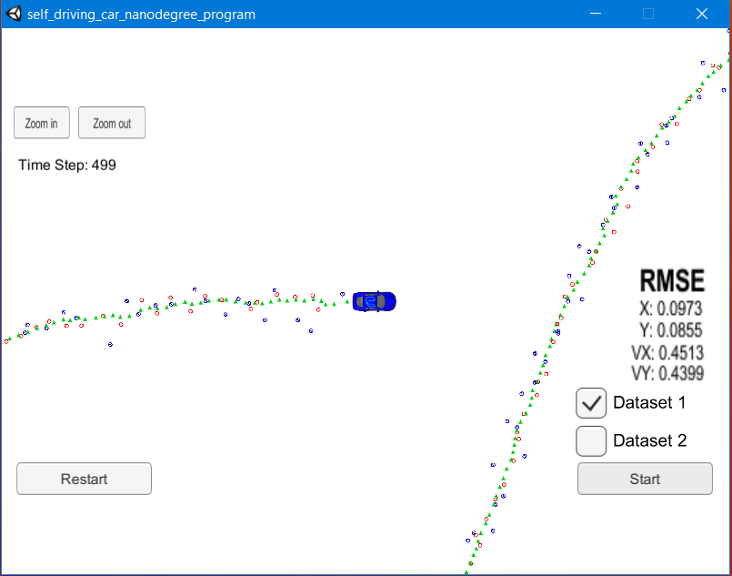
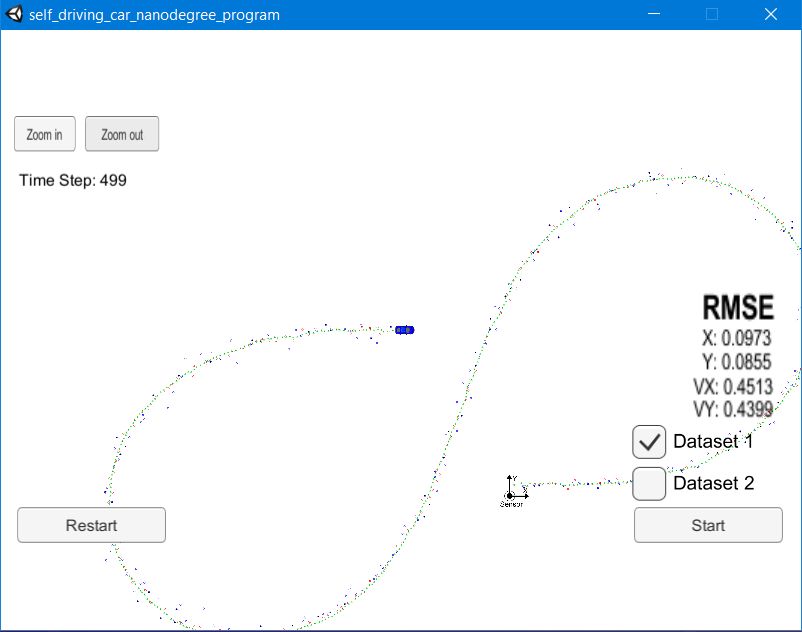

# Extended Kalman Filter Project Code
Self-Driving Car Engineer Nanodegree Program

### Outline
In this project I utilized a kalman filter to estimate the state of a moving object of interest with noisy lidar and radar measurements. The RMSE values are reported on the simulator. 

This project uses the Term 2 Simulator obtained from [here](https://github.com/udacity/self-driving-car-sim/releases).

To develop this project I used the Udacity provided Started code and developed it in Ubuntu VM on Windows host machine. I used the simulator on Windows host.

The project can be built with below steps.

1. mkdir build
2. cd build
3. cmake ..
4. make
5. ./ExtendedKF

Note: Before running the executable & simulator, port forwarding needs to be done on Virtual Machine. Setup the port forwarding for port number 4567 on Virtual Machine.

For this project I have updated :
src/FusionEKF.cpp, 
src/kalman_filter.cpp, 
src/tools.cpp

and implemented the EKF.

### Output

|Dataset| Output | Zoom-out |RMSE|
|--------|----------|----|-----|
|Dataset 1||| **X**:0.09, **Y**:0.08, **VX**:0.45, **VY**:0.44 |
|Dataset 1||| **X**:0.07, **Y**:0.09, **VX**:0.42, **VY**:0.50 |

